# AdSense Automation Website – Project Guide

## Project Purpose
- WordPress sites ke liye high-quality, unique, AdSense-approval focused blog automation service.
- Goal: 6 mahine me AdSense approval, 100% original content, user-friendly dashboard.

---

## Project Flow (User Perspective)
1. Landing page par welcome + AdSense info
2. User onboarding form (name, email, phone, website, category, goals)
3. Site analysis (SEO, content, AdSense readiness)
4. Analysis report + improvement plan
5. Package selection (monthly/6-month)
6. Payment (Razorpay)
7. Dashboard (stats, blog schedule, reports)
8. Automated blog posting (AI + images)
9. Weekly performance report (dashboard)
10. AdSense application guidance
11. Success/celebration screen

---

## Daily/Feature Progress (Update as Project Moves Forward)

### [ ] 2024-06-XX: Project Start
- [ ] Initial requirements finalized
- [ ] Technical stack decided
- [ ] Basic Next.js project setup (pending)

### [ ] 2024-06-XX: Onboarding Form Design
- [ ] Fields: Name, Email, Phone, Website, Category, Start Date, Goals
- [ ] Help button for API key setup

### [ ] 2024-06-XX: Site Analysis Module
- [ ] SEO audit logic
- [ ] AdSense readiness checklist

### [ ] 2024-06-XX: Payment Integration
- [ ] Razorpay test account setup

---

*Is file me project ki choti-choti progress, process steps, aur user-side features add karte jayenge. Technical details ke liye README.tech.md dekhein.* 


  # Detailed n8n Workflow Implementation

## Complete Workflow Flow

```mermaid
graph TD
    A[Webhook Trigger from Next.js] --> B[Fetch User Data from DB]
    B --> C[Get User Onboarding Data]
    C --> D[Extract Category from Onboarding]
    D --> E[SERP API: Get Top 5 Trending Topics]
    E --> F[Save Topics to DB with Status: 'pending_approval']
    F --> G[Notify Next.js Dashboard to Update UI]
    G --> H[Wait for Topic Approval - 2 minutes]
    H -->|User Selects Topic| I[Get Selected Topic from Next.js]
    H -->|Timeout - Auto Select| I[Auto Select First Topic]
    I --> J[Deep Research: ChatGPT + SERP API]
    J --> K[AI Blog Creation: GPT-4o Mini]
    K --> L[Plagiarism & AI Detection Check]
    L --> M[Generate Related Links & Images]
    M --> N[SEO Optimization: Keywords, Title, Description]
    N --> O[Save Blog to DB with Status: 'pending_approval']
    O --> P[Notify Next.js Dashboard for Blog Approval]
    P --> Q[Wait for Blog Approval - 2 minutes]
    Q -->|User Approves| R[Prepare WordPress Payload]
    Q -->|Timeout - Auto Upload| R
    R --> S[Upload to WordPress via WP API]
    S --> T[Update DB: Status 'published', Add WP URL]
    T --> U[Send Email Notification to User]
    U --> V[Log Complete Run to DB]
    V --> W[Schedule Next Run via Cron]
```



## Detailed Implementation Steps

### 1. Webhook Trigger Node
- **Input**: `{ userId: string, email: string }`
- **Action**: Receive webhook from Next.js start-automation API

### 2. Database Query Node - Get User Data
```javascript
// Query user and onboarding data
const userData = await prisma.user.findUnique({
  where: { id: userId },
  include: { onboarding: true }
});
```

### 3. SERP API Node - Get Trending Topics
```javascript
// Use user's category from onboarding
const category = userData.onboarding.category;
const topics = await serpApi.search({
  q: `${category} trending topics 2024`,
  num: 5,
  sort: 'date'
});
```

### 4. Database Update Node - Save Topics
```javascript
// Save topics to new table
await prisma.userTopics.createMany({
  data: topics.map(topic => ({
    userId: userId,
    topic: topic.title,
    source: topic.link,
    status: 'pending_approval',
    createdAt: new Date()
  }))
});
```

### 5. HTTP Request Node - Notify Next.js
```javascript
// Notify dashboard to refresh
await fetch(`${NEXTJS_URL}/api/n8n/topics-ready`, {
  method: 'POST',
  headers: { 'Content-Type': 'application/json' },
  body: JSON.stringify({ userId, topicsCount: 5 })
});
```

### 6. Wait Node - Topic Approval
- **Duration**: 2 minutes
- **Polling**: Every 30 seconds check for user selection

### 7. HTTP Request Node - Get User Selection
```javascript
// Check if user selected topic
const selection = await fetch(`${NEXTJS_URL}/api/n8n/get-topic-selection/${userId}`);
const selectedTopic = selection.data.topic || topics[0]; // Auto-select if no choice
```

### 8. Research Node - Deep Research
```javascript
// Combine ChatGPT + SERP API for research
const research = await chatgpt.complete({
  prompt: `Research this topic deeply: ${selectedTopic}`,
  model: 'gpt-4o-mini'
});

const serpData = await serpApi.search({
  q: selectedTopic,
  num: 10
});
```

### 9. AI Blog Creation Node
```javascript
// Create high-quality blog
const blog = await chatgpt.complete({
  prompt: `Write a comprehensive, SEO-optimized blog post about: ${selectedTopic}. 
  Use this research: ${research}. 
  Make it non-AI detectable, engaging, and 1500+ words.`,
  model: 'gpt-4o-mini'
});
```

### 10. Plagiarism Check Node
```javascript
// Check for plagiarism and AI detection
const plagiarismCheck = await plagiarismApi.check(blog);
const aiDetection = await aiDetector.check(blog);

if (plagiarismCheck.score > 0.8 && aiDetection.score < 0.2) {
  // Blog is good quality
} else {
  // Regenerate with different prompt
}
```

### 11. Content Enhancement Node
```javascript
// Generate related links and images
const relatedLinks = await serpApi.search({
  q: `${selectedTopic} related articles`,
  num: 5
});

const images = await imageApi.generate({
  prompt: selectedTopic,
  count: 3
});
```

### 12. SEO Optimization Node
```javascript
// Optimize for SEO
const seoData = await seoApi.optimize({
  content: blog,
  keyword: selectedTopic,
  generate: ['title', 'description', 'keywords']
});
```

### 13. Database Update Node - Save Blog
```javascript
// Save complete blog data
await prisma.userBlogs.create({
  data: {
    userId: userId,
    topic: selectedTopic,
    content: blog,
    seoTitle: seoData.title,
    seoDescription: seoData.description,
    keywords: seoData.keywords,
    images: images,
    relatedLinks: relatedLinks,
    status: 'pending_approval',
    createdAt: new Date()
  }
});
```

### 14. HTTP Request Node - Notify Blog Ready
```javascript
// Notify dashboard for blog approval
await fetch(`${NEXTJS_URL}/api/n8n/blog-ready`, {
  method: 'POST',
  headers: { 'Content-Type': 'application/json' },
  body: JSON.stringify({ userId, blogId })
});
```

### 15. Wait Node - Blog Approval
- **Duration**: 2 minutes
- **Polling**: Every 30 seconds check for user approval

### 16. WordPress Upload Node
```javascript
// Prepare and upload to WordPress
const wpPayload = {
  title: seoData.title,
  content: blog + images + relatedLinks,
  status: 'draft',
  categories: [userData.onboarding.category]
};

const wpResponse = await wordpressApi.createPost(wpPayload);
```

### 17. Database Update Node - Mark Published
```javascript
// Update blog status
await prisma.userBlogs.update({
  where: { id: blogId },
  data: {
    status: 'published',
    wordpressUrl: wpResponse.link,
    publishedAt: new Date()
  }
});
```

### 18. Email Notification Node
```javascript
// Send email to user
await emailApi.send({
  to: userData.email,
  subject: 'Your blog has been published!',
  template: 'blog-published',
  data: { blogUrl: wpResponse.link, topic: selectedTopic }
});
```

### 19. Logging Node
```javascript
// Log complete automation run
await prisma.automationLogs.create({
  data: {
    userId: userId,
    action: 'blog_published',
    details: {
      topic: selectedTopic,
      wordpressUrl: wpResponse.link,
      runTime: new Date()
    }
  }
});
```

## Database Schema Updates Needed

### New Tables Required:

```sql
-- User Topics Table
CREATE TABLE user_topics (
  id SERIAL PRIMARY KEY,
  userId TEXT NOT NULL,
  topic TEXT NOT NULL,
  source TEXT,
  status TEXT DEFAULT 'pending_approval',
  createdAt TIMESTAMP DEFAULT NOW()
);

-- User Blogs Table
CREATE TABLE user_blogs (
  id SERIAL PRIMARY KEY,
  userId TEXT NOT NULL,
  topic TEXT NOT NULL,
  content TEXT NOT NULL,
  seoTitle TEXT,
  seoDescription TEXT,
  keywords TEXT[],
  images JSONB,
  relatedLinks JSONB,
  status TEXT DEFAULT 'pending_approval',
  wordpressUrl TEXT,
  createdAt TIMESTAMP DEFAULT NOW(),
  publishedAt TIMESTAMP
);

-- Automation Logs Table
CREATE TABLE automation_logs (
  id SERIAL PRIMARY KEY,
  userId TEXT NOT NULL,
  action TEXT NOT NULL,
  details JSONB,
  createdAt TIMESTAMP DEFAULT NOW()
);
```

## Next.js API Endpoints Needed

### 1. `/api/n8n/topics-ready`
- Update dashboard UI when topics are ready
- Show topic selection interface

### 2. `/api/n8n/get-topic-selection/:userId`
- Return user's selected topic or null
- Used by n8n to get selection

### 3. `/api/n8n/blog-ready`
- Update dashboard UI when blog is ready
- Show blog preview and approval interface

### 4. `/api/n8n/get-blog-approval/:userId`
- Return user's blog approval decision
- Used by n8n to get approval

### 5. `/api/user/select-topic`
- User selects topic from dashboard
- Updates database

### 6. `/api/user/approve-blog`
- User approves blog from dashboard
- Updates database

## Dashboard UI Updates

### Topic Selection Interface
- Show 5 trending topics with radio buttons
- 2-minute countdown timer
- Auto-select warning

### Blog Approval Interface
- Show blog preview with SEO data
- Approve/Reject buttons
- 2-minute countdown timer
- Auto-approve warning

## Key Features

1. **Real-time Updates**: Dashboard updates immediately when n8n sends notifications
2. **Auto-selection**: If user doesn't select within 2 minutes, auto-select happens
3. **Quality Control**: Plagiarism and AI detection checks
4. **SEO Optimization**: Automatic SEO optimization
5. **WordPress Integration**: Direct upload to user's WordPress site
6. **Complete Logging**: All actions logged for tracking
7. **Email Notifications**: User gets notified when blog is published

## Error Handling

- If any step fails, log error and retry
- If user data not found, stop workflow
- If SERP API fails, use fallback topics
- If WordPress upload fails, save as draft and notify user
- If approval timeout, auto-approve and continue 